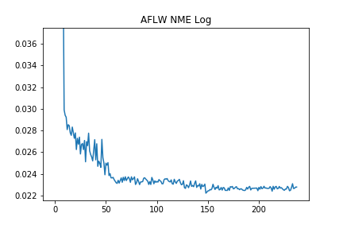

# RetinaFace in PyTorch
Original Repository : https://github.com/biubug6/Pytorch_Retinaface 


## Pre-trained Backbone Weights
```
wget https://download.pytorch.org/models/resnet50-19c8e357.pth # Resnet50
wget https://publicmodels.blob.core.windows.net/container/aa/efficientnet-b0-355c32eb.pth # EfficientNet-b0
wget https://publicmodels.blob.core.windows.net/container/aa/efficientnet-b1-f1951068.pth # EfficientNet-b1
wget https://publicmodels.blob.core.windows.net/container/aa/efficientnet-b2-8bb594d6.pth # EfficientNet-b2
wget https://publicmodels.blob.core.windows.net/container/aa/efficientnet-b3-5fb5a3c3.pth # EfficientNet-b3
wget https://publicmodels.blob.core.windows.net/container/aa/efficientnet-b4-6ed6700e.pth # EfficientNet-b4
```
[Google Drive](https://drive.google.com/drive/folders/1oZRSG0ZegbVkVwUd8wUIQx8W7yfZ_ki1)

## Train
```
sh download_weights.sh
# Local
CUDA_VISIBLE_DEVICES="gpu_id" python train.py --network efficientb4-3fpn --save_folder result --pretrained_backbone efficientnet-b4-6ed6700e.pth
# NSML
nsml run -e train.py -d prod-nfs -d prod-nfs2 --nfs-output -a '--network efficientb4-3fpn --save_folder result --pretrained_backbone efficientnet-b4-6ed6700e.pth' -g 4 -c 20 --shm-size 20G
```

## Performance
| Backbone           | Easy AP | Medium AP | Hard AP | mAP  | NME  | Latency  |
| :----------------: | ------: | --------: | ------: | ---: | ---: | -------: |
| Resnet50 (3fpn)    |         |           |         |      | 2.54 | 517.39   |
| Mobile0.25 (3fpn)  |         |           |         |      | 3.49 | 35.19    |
| Efficientb0 (3fpn) |         |           |         |      | 2.45 | 247.04   |
| Efficientb1 (3fpn) |         |           |         |      | 2.41 | 301.59   |
| Efficientb2 (3fpn) |         |           |         |      | 2.52 | 305.72   |
| Efficientb3 (3fpn) |         |           |         |      | 2.41 | 365.54   |
| Efficientb4 (3fpn) | 94.11   | 90.72     | 72.90   |      | 2.22 | 488.49   |
| Efficientb4 (Bifpn)| 94.90   | 92.24     | 77.37   |      | 2.22 | 414.78   |

- Latency is calculated after batch normalization folding.
- Image size for latency check is 320 x 320.
- NME is calculated on AFLW dataset.
- Loss and AP is calculated on WiderFace dataset.
- Loss_total = 2.0 * Loss_cls + Loss_box


## Log
<br><center></center>
<center></center></br>

## Sample Images
WiderFace Validation Result : [Link](http://10.106.154.45:9804/widerface_evaluate0.2_0.2/widerface_img/)
- Multi

- WiderFace

- Blurry
<br>
- Occlusion


## Issue
- AP performance

## References
- [FaceBoxes](https://github.com/zisianw/FaceBoxes.PyTorch)
- [Retinaface (mxnet)](https://github.com/deepinsight/insightface/tree/master/RetinaFace)

```
@inproceedings{deng2019retinaface,
title={RetinaFace: Single-stage Dense Face Localisation in the Wild},
author={Deng, Jiankang and Guo, Jia and Yuxiang, Zhou and Jinke Yu and Irene Kotsia and Zafeiriou, Stefanos},
booktitle={arxiv},
year={2019}
```
